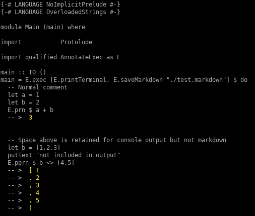

# Annotate haskell sample code

This library provides a simple but very limited way to quickly generate haskell source code annotated with its results. I find this useful when testing new packages and doing simple code demos.

A IHaskell notebook is a more robust alternative. However I like this approach when I'm doing something small/simple. The advantages being that it is lightweight and runs in a normal haskell executable so you can use template haskell etc.


## Usage

Run a block of code in an `exec` block calling `prn` or `pprn` for anything you want to see output for. Select which printers you want to use. Currently they are `printTerminal`, `printMarkdown` and `saveMarkdown`


For example this code

```haskell
{-# LANGUAGE NoImplicitPrelude #-}
{-# LANGUAGE OverloadedStrings #-}

module Main (main) where

import           Protolude

import qualified AnnotateExec as E

main :: IO ()
main = E.exec [E.printTerminal, E.saveMarkdown "./test.markdown"] $ do
  -- Normal comment
  let a = 1
  let b = 2
  E.prn $ a + b


  -- Space above is retained for console output but not markdown
  let b = [1,2,3]
  putText "not included in output"
  E.pprn $ b <> [4,5]
```

This will print the annotated results to the terminal with the results as comments below each `prn` and `pprn`.



The `saveMarkdown` printer will create markdown that looks like this

-----------------------------------------------------------------------------------

# Main
```haskell
{-# LANGUAGE NoImplicitPrelude #-}
{-# LANGUAGE OverloadedStrings #-}

module Main (main) where

import           Protolude

import qualified AnnotateExec as E

main :: IO ()
main = E.exec [E.printTerminal, E.saveMarkdown "./test.markdown"] $ do
  -- Normal comment
  let a = 1
  let b = 2
  E.prn $ a + b
```

```
>  3
```

```haskell
  -- Space above is retained for console output but not markdown
  let b = [1,2,3]
  putText "not included in output"
  E.pprn $ b <> [4,5]
```

```
>  [ 1
>  , 2
>  , 3
>  , 4
>  , 5
>  ] 
```
-----------------------------------------------------------------------------------

# GHCID

You can use ghcid to run and print your annotated code as you edit it

e.g. using ghcid and stack for this project's executable

`stack exec -- ghcid -c "stack ghci annotateExec:lib --ghci-options='-fobject-code' --main-is annotateExec:exe:annotateExec-exe" --test=":main debug" -W`

